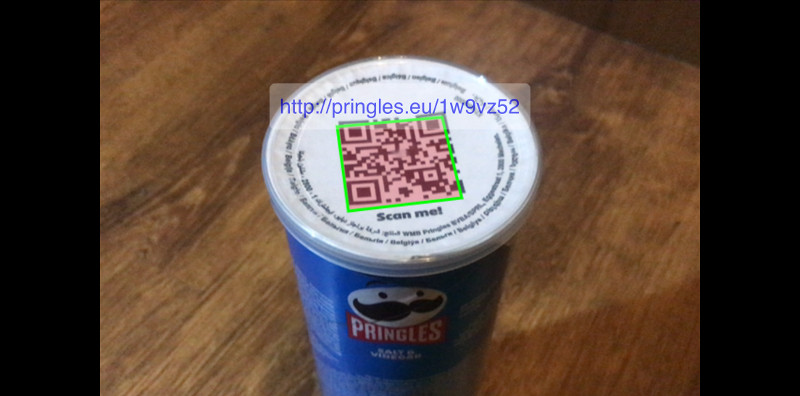
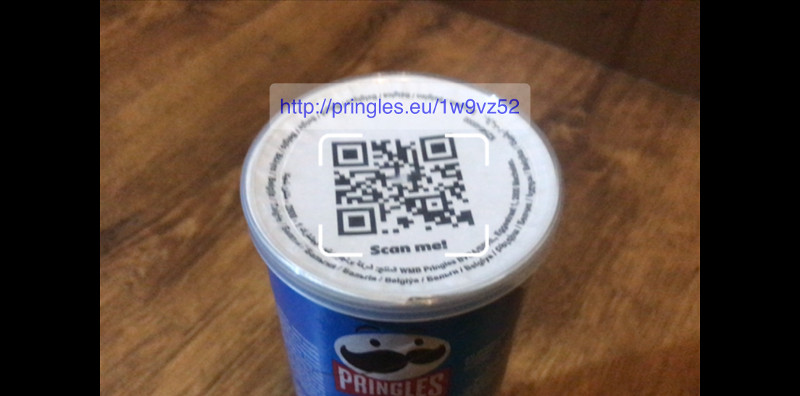
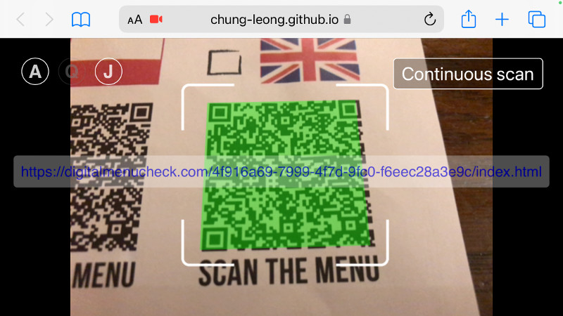

# React-barcode-detection  

React-barcode-detection provides an easy-to-use component that lets your app capture 
barcodes of various formats, including 2D varieties such as QR code. It utilizes the 
new [Barcode Detection API](https://developer.mozilla.org/en-US/docs/Web/API/Barcode_Detection_API). 
On [platforms that lack support](https://developer.mozilla.org/en-US/docs/Web/API/BarcodeDetector#browser_compatibility), 
the library provides fallbacks for scanning QR code.

Video capture functionality is provided by 
[react-media-capture](https://github.com/chung-leong/react-media-capture#readme).

# Insallation

```sh
npm install --save-dev react-barcode-detection
```

If you're using npm 14.x, you'll need to manually install the peer dependency 
[react-seq](https://github.com/chung-leong/react-media-capture#readme).

# Basic usage

```js
import { useState } from 'react';
import { BarcodeScanner } from 'react-barcode-detection';

function QRScreen() {
  const [ data, setData ] = useState();
  return (
    <div className="QRScreen">
      <BarcodeScanner onData={setData} />;
      <div className="data">{data}</div>
    </div>
  );
}
```

`BarcodeScanner` connects to the device's camera and provides a live preview. By default it scans for QR code. When one enters into the camera's view, the component invokes the `onData` callback. When the code disappears, the same callback is given `undefined`.

# Providing visual cue

It's important to let the user know that your app is able to recognize a code. Use the `cornerPoints` prop to tell `BarcodeScanner` to draw a quadrilateral where the code appears in the video:

```js
const cp = {
  stroke: '#00ff00',
  fill: 'rgba(255, 0, 0, 0.25)',
  lineWidth: 3,
};

function QRScreen() {
  const [ data, setData ] = useState();
  return (
    <div className="QRScreen">
      <BarcodeScanner cornerPoints={cp} onData={setData} />;
      <div className="data">{data}</div>
    </div>
  );
}
```

The code above draws a quadrilateral with green outline and red translucent interior:



Alternately, you can draw a "targetting box" over the area by specifying `boundingBox`:

```js
const bb = {
  stroke: '#fff',
  lineWidth: 4,
  radii: 10,
  gap: 0.5,
  margin: 0.1
};

function QRScreen() {
  const [ data, setData ] = useState();
  return (
    <div className="QRScreen">
      <BarcodeScanner boundingBox={bb} onData={setData} />;
      <div className="data">{data}</div>
    </div>
  );
}
```



If you app exits from the scanner screen as soon as it finds a correct code, you might choose to 
delay the exit slightly so the user actually has a chance to see the visual indicator. In 
that case you would want to make `clearInterval` longer (the default is 250ms) so the 
code does not disappear (due to the user's shaky hand, for instance) during the delay.

Another way to let the user know that a code has been captured is to switch from the live video to a frozen frame. You app will receive a JPEG snapshot upon barcode detection when you provide a 
`onSnapshot` handler. 

Check out the [live demo](https://chung-leong.github.io/react-barcode-detection/) to see the 
component in action. You can see the source code [here](./demo/src/App.js).

## Detecting other barcode types

`BarcodeScanner` looks for QR codes by default. To scan for barcodes of other formats, 
set the `accept` prop to a comma-delimited list of formats: 

```js
const bb = {
  stroke: '#fff',
  lineWidth: 4,
  radii: 10,
  gap: 0.5,
  margin: 0.1
};

function UTCScreen() {
  const [ data, setData ] = useState();
  return (
    <div className="UTCScreen">
      <BarcodeScanner boundingBox={bb} accept="upc_a,upc_e" onData={setData} />;
      <div className="data">{data}</div>
    </div>
  );
}
```

A list of available formats can be found at
[Mozilla](https://developer.mozilla.org/en-US/docs/Web/API/Barcode_Detection_API#supported_barcode_formats).

## QR code support fallback

As of writing, the 
[Barcode Detection API](https://developer.mozilla.org/en-US/docs/Web/API/Barcode_Detection_API#browser_compatibility) is not available on Windows or iOS. 
This library provides fallback for scanning QR codes using 
[jsQR](https://github.com/cozmo/jsQR). 

A second fallback based on [quirc](https://github.com/dlbeer/quirc) is available. 
It's more efficient since it uses WebAssembly, but is not as tolerant of poor 
lighting conditions as jsQR. It might be appropriate for less powerful mobile 
devices. 

To enable the use of quirc, set the `use` prop to "api,quirc,jsqr":

```js
const cp = {
  fill: 'rgba(0, 255, 0, 0.5)',
};

function UTCScreen() {
  const [ data, setData ] = useState();
  return (
    <div className="UTCScreen">
      <BarcodeScanner cornerPoints={cp} use="api,quirc,jsqr" onData={setData} />;
      <div className="data">{data}</div>
    </div>
  );
}
```

## Live demo

The live demo is designed to run on either a desktop or a mobile environment. It shows you 
the different ways your app can respond to the detection of a QR code.



Click on one of the letters on the left to toggle the different methods. "A" is the
Barcode API (will be used if available), "Q" is the WebAssembly-based quirc. "J" is 
jsQR. 

## API Reference

* [BarcodeScanner](./doc/BarcodeScanner.md#readme)
* [BlobImage](./doc/BlobImage.md#readme)
* [StreamVideo](./doc/StreamVideo.md#readme)
* [useBarcodeDetection](./doc/useBarcodeDetection.md#readme)
